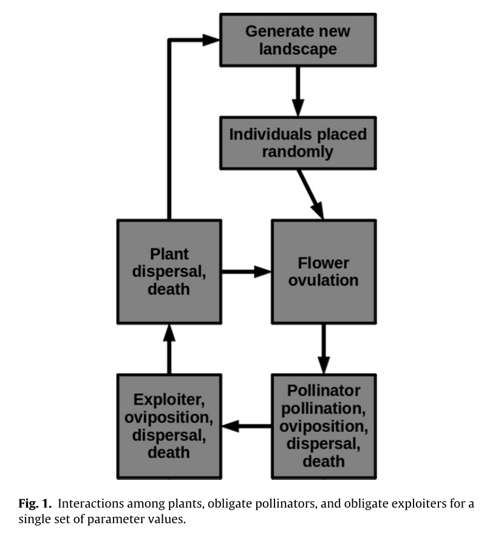
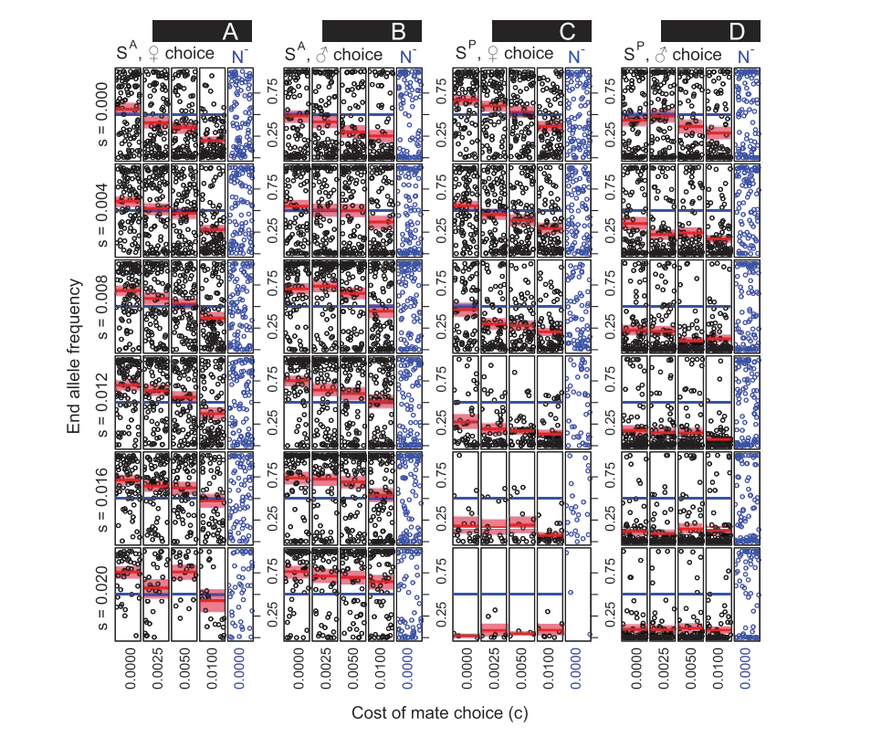

```{r, echo = FALSE}
library(knitr);
opts_chunk$set(echo = FALSE);
```

## Individual-based modelling: what is it?

- Simulate a system *in silico*, using computer code \newline\pause

- Individuals are represented as discrete entities

```{r, out.width = "80%", echo = FALSE, fig.cap = ""}
include_graphics("images/individuals.pdf");
```

\footnotetext[1]{Duthie, A. B., \& Reid, J. M. (2016). {\it Am. Nat.} \href{https://doi.org/10.1086/688919}{186, 651-667}.}

## Individual-based modelling: what is it?

\begin{columns}
\begin{column}{0.4\textwidth} 
```{r, out.width = "100%", echo = FALSE, fig.cap = ""}
;
```
\end{column}

\begin{column}{0.6\textwidth}

\begin{itemize}
\item Processes are often stochastic (events probabilistic) \newline\pause
\item Can test ideas by simulating across many parameters \newline\pause
\item Highly mechanistic models are possible
\end{itemize}
\end{column}
\end{columns}

\footnotetext[1]{Duthie, A. B., \& Falcy, M. R. (2013). {\it Ecol. Modell.} \href{https://doi.org/10.1016/j.ecolmodel.2012.12.019}{251, 260-270}.}

## Advantages & disadvantages of using IBMs

**Advantages**

1. Very easy to model individual variation (genetic, phenotypic, environment, etc.)

2. Key biological processes are inherent to the model (e.g., drift, mutation, demography)

3. Models can often be more detailed and therefore more targeted \pause

**Disadvantages**

1. Computational power can be limiting

2. Sometimes difficult to see the link between model assumptions and model predictions (i.e., difficult to interpret results)

## Advantages & disadvantages of using IBMs

```{r, out.width = "80%", echo = FALSE, fig.cap = ""}
;
```

\footnotetext[1]{Duthie, A. B., \& Reid, J. M. (2016). {\it Am. Nat.} \href{https://doi.org/10.1086/688919}{186, 651-667}.}


## Getting started using R for IBMs

- **Objective**: Learn how to start writing IBMs from a basic knowledge of R coding \newline

- **Notes**: Walk through [all of the code](https://stirlingcodingclub.github.io/individual_based_modelling/ibm_notes.html) required to get started with a basic predator-prey model \newline

- **Caveat**: Code in the notes is not optimised for speed \newline

- **Languages**: Other languages such as [C](https://en.wikipedia.org/wiki/C_(programming_language)),  [C++](https://en.wikipedia.org/wiki/C%2B%2B), or [NetLogo](https://ccl.northwestern.edu/netlogo/) are also worth considering 

## One way to model individuals in an IBM

**Rows are individuals \& columns are individual characteristics** \newline


```{r, echo = FALSE}
library(knitr);
inds           <- array(data = 0, dim = c(8, 5));
colnames(inds) <- c("ind_ID", "x_loc", "y_loc", "body_mass", "age");
#rownames(inds) <- c("ind_1", "ind_2", "ind_3", "ind_4", "ind_5", "ind_6", "ind_7", "ind_8");
inds[,1] <- 1:8;
inds[,2] <- sample(x = 1:8, size = 8, replace = TRUE);
inds[,3] <- sample(x = 1:8, size = 8, replace = FALSE);
inds[,4] <- round(rnorm(n = 8, mean = 40, sd = 6), digits = 2);
inds[,5] <- sample(x = 1:6, size = 8, replace = TRUE);
kable(inds);
```

The process of modelling is then to do something to the individuals and their characteristics -- have them interact, change, be removed, have more added. Models are as complex as we are willing to code.


## Individual-based models are often spatially explicit

```{r, echo = FALSE}
xlocs <- sample(x = 1:8, size = 6, replace = TRUE);
ylocs <- sample(x = 1:8, size = 6, replace = FALSE);
ind2           <- array(data = 0, dim = c(6, 3));
colnames(ind2) <- c("ind_ID", "x_loc", "y_loc");
ind2[,1] <- 1:6;
ind2[,2] <- xlocs;
ind2[,3] <- ylocs;
```

\begin{columns}
\begin{column}{0.5\textwidth} 
```{r, out.width = "100%", echo = FALSE, fig.cap = "", fig.width = 4.5, fig.height = 4.5}
par(mar = c(5, 5, 1, 1));
plot(x = 1:8, y = 1:8, type = "n", xaxt = "n", yaxt = "n", xlab = "x location", 
     ylab = "y location", xlim = c(0.5, 8.5), ylim = c(0.5, 8.5), yaxs= 'i', 
     xaxs = 'i', cex.lab = 1.5);
axis(side = 1, at = 1:8, labels = 1:8, cex.axis = 1.5);
axis(side = 2, at = 1:8, labels = 1:8, cex.axis = 1.5);
pt <- seq(from = 0.5, to = 7.5, length = 8);
for(i in 1:8){
    abline(v = pt[i]);
    abline(h = pt[i]);
}
points(x = inds[,2], y = inds[,3], pch = 20, cex = 6, col = "blue");
text(x = inds[,2], y = inds[,3], labels = 1:8, col = "white");
```
\end{column}

\begin{column}{0.5\textwidth}
\begin{itemize}
\item Individual locations can be mapped to a landscape, with rules for movement
\item Movement entails rules for changing x and y locations
\item Landscape need not be represented in code, but can be to define landscape properties
\end{itemize}
\end{column}
\end{columns}


## Simulate individuals over multiple time steps

**Define individuals**

```
inds      <- array(data = 0, dim = c(5, 3));
inds[, 1] <- 1:5;
inds[, 2] <- sample(x = 1:8, size = 5, replace = TRUE);
inds[, 3] <- sample(x = 1:8, size = 5, replace = TRUE);
```

**Move individuals to the right 5 times**

```
ts         <- 0;
time_steps <- 5;
while(ts < time_steps){
    inds[, 2] <- inds[, 2] + 1;
    ts   <- ts + 1; 
}
```

## Working through the IBM notes

\hrule\vspace{2mm}

[https://stirlingcodingclub.github.io/individual_based_modelling/ibm_notes.html](https://stirlingcodingclub.github.io/individual_based_modelling/ibm_notes.html)

\vspace{2mm}
\hrule

\vspace{10mm}

- Walks through R code for modelling individual movement, birth, death, and predation over time \newline
- Get as far as you can today -- meant to be a starting point \newline
- Ask questions here and in the [GitHub Repository issues page](https://github.com/StirlingCodingClub/individual_based_modelling/issues)


